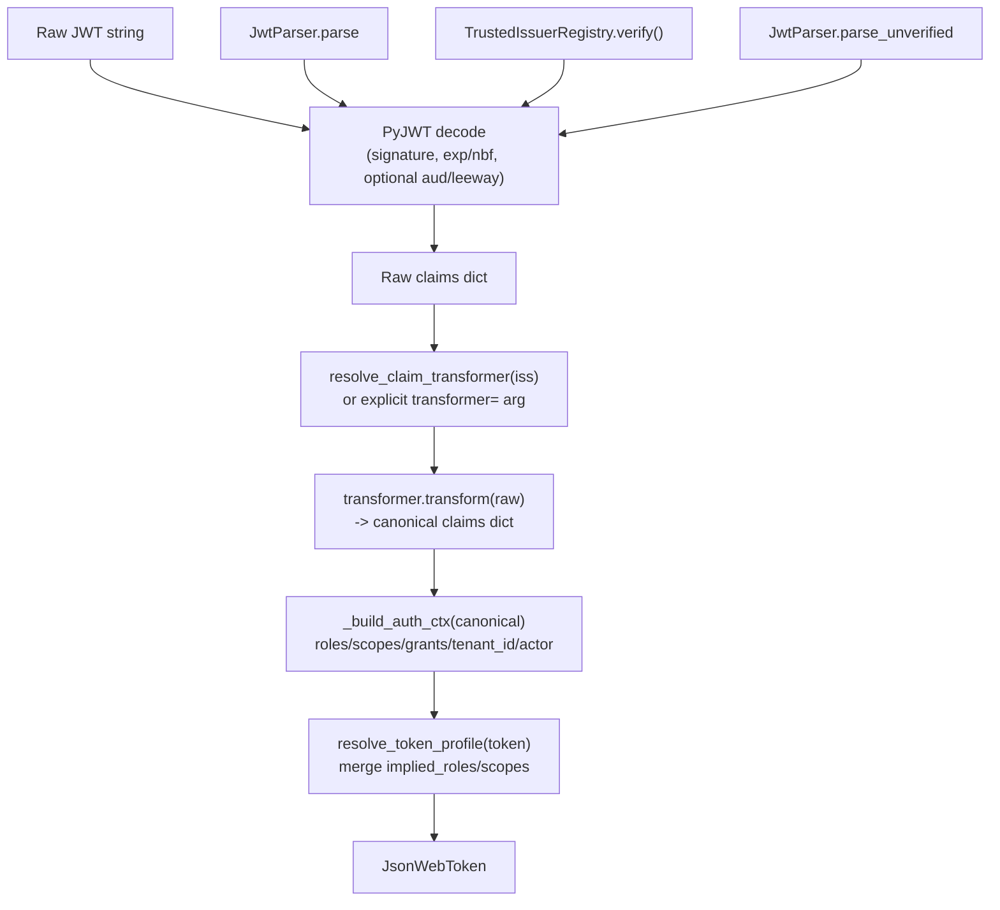

# JWT Claim Transformer — Technical Reference

The claim-transformation layer (`varco_core.jwt.transform`) lets varco consume
**foreign-shaped JWTs** — Keycloak, Cognito, Auth0, a bespoke `sofy-roles` claim, … —
by mapping the issuer's claim names onto the canonical set `varco_core.jwt` builds
`AuthContext` from, either **environment-variable-driven** (zero code changes) or
**code-configured** (`ClaimMapping`).

---

## Core files

| File | Role |
|---|---|
| `varco_core/jwt/transform/path.py` | `ClaimPath`, `MISSING` sentinel, `read_claim()` — dotted nested-claim access |
| `varco_core/jwt/transform/shape.py` | `ValueShape` + `normalize()` — value-shape normalization |
| `varco_core/jwt/transform/mapping.py` | `CanonicalClaim`, `ClaimRule`, `ClaimMapping` — the code-configured value objects |
| `varco_core/jwt/transform/protocol.py` | `ClaimTransformer` Protocol, `IdentityClaimTransformer`, `IDENTITY` |
| `varco_core/jwt/transform/mapper.py` | `MappingClaimTransformer` — wraps a `ClaimMapping` |
| `varco_core/jwt/transform/registry.py` | `ClaimTransformerRegistry` — per-issuer lookup |
| `varco_core/jwt/transform/config.py` | `JwtTransformSettings` (flat env) + `JwtTransformConfig` (global + per-issuer) |
| `varco_core/jwt/transform/runtime.py` | Process-global `resolve_claim_transformer()` / `configure_claim_transforms()` / `reset_claim_transforms()` |
| `varco_core/jwt/config.py` | `JwtVerificationSettings` — leeway + audience (verification hardening) |
| `varco_core/jwt/exceptions.py` | `JwtException`, `ClaimTransformError`, `TokenProfileError` |
| `varco_core/jwt/parser.py` | `JwtParser._from_raw_claims` — the single funnel that applies the transformer |
| `varco_core/authority/registry.py` | `TrustedIssuerRegistry.verify()` — delegates to the same funnel |
| `varco_fastapi/auth/server_auth.py` | `JwtBearerAuth` (SEAM 2) and `PassthroughAuth` — both get transformation for free |

---

## Pipeline

The transformer and token-profile resolution both run inside `JwtParser._from_raw_claims`,
the single insertion point shared by every JWT entry point in the codebase:



Because `TrustedIssuerRegistry.verify()` calls `JwtParser._from_raw_claims` directly
(`registry.py:630`), `varco_fastapi`'s `JwtBearerAuth` needs **zero** extra code to
benefit from claim transformation — it is "SEAM 2" in the diagram above, reached via
`verify()`. `PassthroughAuth` was refactored onto `JwtParser.parse_unverified()` for
the same reason (it used to hand-roll its own claim parsing).

`extra_claims` on the resulting `JsonWebToken` is always built from the **raw**
(pre-transform) dict — a foreign claim name like `sofy-roles` stays visible for
audit/debug even after it has also been consumed into the canonical `roles` field.

---

## `ClaimTransformer` — the extension point

```python
from typing import Protocol, runtime_checkable
from collections.abc import Mapping
from typing import Any


@runtime_checkable
class ClaimTransformer(Protocol):
    def transform(self, claims: Mapping[str, Any]) -> Mapping[str, Any]: ...
```

| Implementation | Purpose |
|---|---|
| `IdentityClaimTransformer` (`IDENTITY` singleton) | returns `claims` unchanged, **no copy** — the zero-config hot path |
| `MappingClaimTransformer(ClaimMapping)` | the config-driven default (code or env) |
| your own class | anything with a `transform(claims)` method — no inheritance required (it's a `Protocol`) |

A `ClaimTransformer` is a structural `Protocol`, not an ABC, so an existing adapter
class in your codebase that already has a compatible `transform()` method satisfies it
without inheriting from any varco base class — the escape hatch for logic that can't
be expressed as a `ClaimMapping` (call an internal user directory, decrypt a claim, …):

```python
class MyDirectoryTransformer:
    def transform(self, claims: dict) -> dict:
        claims = dict(claims)
        claims["roles"] = my_directory.roles_for(claims["sub"])
        return claims


token = JwtParser.parse(raw, secret, algorithms=["HS256"], transformer=MyDirectoryTransformer())
```

---

## Code-configured `ClaimMapping`

```python
from varco_core.jwt.transform import (
    CanonicalClaim,
    ClaimMapping,
    ClaimPath,
    ClaimRule,
    ValueShape,
)

mapping = ClaimMapping(
    rules=(
        ClaimRule(
            target=CanonicalClaim.ROLES,
            sources=(ClaimPath.parse("realm_access.roles"), ClaimPath.parse("roles")),
            strip_prefix="ROLE_",  # Keycloak/Spring convention
        ),
        ClaimRule(
            target=CanonicalClaim.SCOPES,
            sources=(ClaimPath.parse("scope"),),
            shape=ValueShape.SPACE,  # "read write" -> ["read", "write"]
        ),
        ClaimRule(
            target=CanonicalClaim.TENANT_ID,
            sources=(ClaimPath.parse("org.id"),),
            required=True,  # raises ClaimTransformError if missing
        ),
    ),
)
```

Canonical targets deliberately **exclude** `sub`/`iss`/`aud`/`exp`/`iat`/`nbf`/`jti` —
those are verified by PyJWT before this layer runs, and `iss` is the mapping
*selector*, so remapping it would be circular:

| `CanonicalClaim` | Lands on |
|---|---|
| `USER_ID` | `AuthContext.user_id` (default source: `sub`; `token.sub` still stays raw) |
| `ROLES` | `AuthContext.roles` |
| `SCOPES` | `AuthContext.scopes` |
| `GRANTS` | `AuthContext.grants` |
| `TENANT_ID` | `AuthContext.metadata["tenant_id"]` |
| `ACTOR` | `AuthContext.metadata["actor"]` (RFC 8693 `act`) |
| `TOKEN_TYPE` | `JsonWebToken.token_type` |
| `TENANTS` | `AuthContext.metadata["tenants"]`, a **list** — the tenant↔subject membership claim consumed by `varco_core.tenancy.membership.ClaimTenantMembership` (Plan 033 / S5). Env: `VARCO_JWT_TRANSFORM_TENANTS_FIELD` / `VARCO_JWT_TRANSFORM__<LABEL>__TENANTS_FIELD`; default source `tenants` |

**Fallback chains, always canonical-last**: a rule's `sources` is tried in order,
first-non-empty wins by default (`merge=True` unions the whole chain instead). The
env-driven builder always appends the canonical name as the last fallback source, so
a mixed fleet (some tokens canonical, some foreign) works with one configuration.

**Nested paths**: dotted (`realm_access.roles`), configurable separator, `\.` escapes
a literal dot. Reading through a list index is **not** supported — no observed
real-world claim needs it, and it would require a JSONPath dependency for a
one-in-a-thousand case.

---

## Environment-variable configuration

### Global (flat) variables — `VARCO_JWT_TRANSFORM_*`

| Env var | Type | Default | Meaning |
|---|---|---|---|
| `VARCO_JWT_TRANSFORM_ROLES_FIELD` | `str` | `None` | comma-separated fallback chain of claim paths |
| `VARCO_JWT_TRANSFORM_SCOPES_FIELD` | `str` | `None` | idem |
| `VARCO_JWT_TRANSFORM_GRANTS_FIELD` | `str` | `None` | idem |
| `VARCO_JWT_TRANSFORM_USER_ID_FIELD` | `str` | `None` | idem — does **not** change `token.sub` |
| `VARCO_JWT_TRANSFORM_TENANT_FIELD` | `str` | `None` | → `metadata["tenant_id"]` |
| `VARCO_JWT_TRANSFORM_ACTOR_FIELD` | `str` | `None` | → `metadata["actor"]`; default source `act` |
| `VARCO_JWT_TRANSFORM_TOKEN_TYPE_FIELD` | `str` | `None` | e.g. `typ` (Keycloak), `token_use` (Cognito) |
| `VARCO_JWT_TRANSFORM_METADATA_FIELDS` | `str` | `None` | `key=path,key2=path2` → `metadata[key]` |
| `VARCO_JWT_TRANSFORM_<T>_SHAPE` | `str` | `auto` | `<T>` ∈ `ROLES,SCOPES,GRANTS,USER_ID,TENANT,ACTOR,TOKEN_TYPE` |
| `VARCO_JWT_TRANSFORM_<T>_STRIP_PREFIX` | `str` | `None` | per-target element prefix strip |
| `VARCO_JWT_TRANSFORM_<T>_REQUIRED` | `bool` | `false` | missing → `ClaimTransformError` |
| `VARCO_JWT_TRANSFORM_MERGE_SOURCES` | `bool` | `false` | `false` = first-non-empty wins; `true` = union the whole chain |
| `VARCO_JWT_TRANSFORM_PATH_SEPARATOR` | `str` | `.` | escape a literal separator with `\.` |
| `VARCO_JWT_TRANSFORM_STRICT` | `bool` | `false` | shape/type violations raise instead of warn-and-skip |
| `VARCO_JWT_LEEWAY_SECONDS` | `float` | `0.0` | clock-skew leeway (see Verification hardening below) |
| `VARCO_JWT_AUDIENCE` | `str` | `None` | this service's expected `aud` (see Verification hardening below) |

⚠️ **Field lists are `str`, not `list[str]`.** pydantic-settings parses a `list[str]`
field from a single env var as JSON, which would force
`ROLES_FIELD='["sofy-roles","roles"]'`. Declaring `str` and splitting on `,` keeps the
human-friendly `"sofy-roles,realm_access.roles"` form.

### Per-issuer overrides — `VARCO_JWT_TRANSFORM__<LABEL>__*`

```bash
VARCO_JWT_TRANSFORM__KEYCLOAK__ISS         = https://kc.example.com/realms/sofy
VARCO_JWT_TRANSFORM__KEYCLOAK__ROLES_FIELD = realm_access.roles
VARCO_JWT_TRANSFORM__KEYCLOAK__SCOPES_FIELD= scope
```

`__ISS` is optional: when absent, the loader falls back to
`FASTREST_AUTHORIZATION__<LABEL>__ISS` (the same label already used to configure
`TrustedIssuerRegistry.from_env()`), and failing that, normalises the label itself
(`KEYCLOAK` → `keycloak`).

**Precedence** — resolved by the token's `iss` claim:

```
per-issuer mapping for token.iss   (field-by-field override, inherits the global)
        ↓ falls back to
global  VARCO_JWT_TRANSFORM_*      mapping
        ↓ falls back to
IDENTITY (canonical names only)    ← zero-config = today's behaviour
```

A per-issuer mapping only needs to declare the fields it *overrides* — anything it
doesn't set (e.g. `STRICT`, `SCOPES_FIELD`) inherits from the global mapping
(`ClaimMapping.merged_with()`). Two labels declaring the same resolved `iss` raise
`ClaimTransformError` at config-load time, naming both labels — a fail-fast
ambiguity check rather than silently picking one.

An `iss` that matches **no** configured label falls back to the global mapping —
never an error. An unmapped issuer with no global config either → `IDENTITY`.

---

## Recipes

### Keycloak

```bash
export VARCO_JWT_TRANSFORM_ROLES_FIELD="realm_access.roles"
export VARCO_JWT_TRANSFORM_ROLES_STRIP_PREFIX="ROLE_"
export VARCO_JWT_TRANSFORM_TOKEN_TYPE_FIELD="typ"
```

### AWS Cognito

```bash
export VARCO_JWT_TRANSFORM_ROLES_FIELD="cognito:groups"
export VARCO_JWT_TRANSFORM_TOKEN_TYPE_FIELD="token_use"   # "access" | "id"
export VARCO_JWT_TRANSFORM_SCOPES_FIELD="scope"
```

### Auth0

```bash
export VARCO_JWT_TRANSFORM_ROLES_FIELD="https://myapp.example.com/roles"
export VARCO_JWT_TRANSFORM_SCOPES_FIELD="scope"
export VARCO_JWT_TRANSFORM_TENANT_FIELD="https://myapp.example.com/org_id"
```

Auth0 namespaces custom claims as full URLs — `ClaimPath.parse()` still works because
the whole namespaced string is a single (non-dotted) claim key; only use the dotted
separator for genuinely nested JSON, not for namespace-prefixed flat keys.

---

## Verification hardening (leeway + audience)

Two gaps that predate this layer are addressed alongside it, via
`varco_core.jwt.config.JwtVerificationSettings` (`env_prefix="VARCO_JWT_"`):

| Env var | Default | Effect |
|---|---|---|
| `VARCO_JWT_LEEWAY_SECONDS` | `0.0` | clock-skew leeway applied to `exp`/`nbf` checks — `0.0` is byte-identical to pre-existing behaviour |
| `VARCO_JWT_AUDIENCE` | `None` | this service's expected `aud` — `None` means **not enforced** (opt-in hardening) |

Both are threaded through every verification entry point:
`JwtParser.parse(leeway=...)`, `TrustedIssuerRegistry.verify(audience=..., leeway=...)`,
and `JwtBearerAuth(audience=..., leeway=...)` (all fall back to the env vars above
when the constructor/call argument is omitted).

**Clock skew** (`VARCO_JWT_LEEWAY_SECONDS`) — a classic cause of intermittent 401s
across hosts whose clocks have drifted a few seconds: a token that expired (or isn't
yet valid per `nbf`) only *just* outside the leeway window is rejected; inside it, it
is accepted. `30` seconds is a common production value.

**Audience enforcement** (`VARCO_JWT_AUDIENCE`) — before this layer, `aud` was
**never** checked in the HTTP path: `JwtBearerAuth.__call__` called
`registry.verify(raw_token)` with no `audience=`, so a token minted for a completely
different service was accepted as long as its signature verified. Setting
`VARCO_JWT_AUDIENCE` (or passing `audience=` to `JwtBearerAuth`) closes this gap.
The default stays `None` (unenforced) so existing deployments aren't broken by
tokens that don't carry a matching `aud` — `JwtBearerAuth` logs **one** warning at
construction time when `audience` is unset, prompting you to opt in.

`TrustedIssuerRegistry.verify()` explicitly disables PyJWT's own `verify_aud=True`
default when no `audience` is passed — otherwise a token that happens to carry an
`aud` claim would be rejected even though no expected audience was ever configured.

`iss` enforcement remains **out of scope** here (`registry.verify()` deliberately
does not check it) — use `JwtUtil(token).is_issuer(...)` after verification, or a
`TokenProfile` (see `technical_docs/features/token-profiles.md`) that constrains
`issuers` for tokens that need it.

---

## JWKS caching knobs, and the background refresher (Plan 041 / S22)

`TrustedIssuerRegistry` has two constructor args (mirrored by env vars) that tune
when its in-memory keyset cache refreshes:

```python
TrustedIssuerRegistry(
    min_refresh_interval=10.0,  # VARCO_JWKS_MIN_REFRESH_SECONDS (default)
    ttl_seconds=0.0,  # VARCO_JWKS_TTL_SECONDS (default — disabled)
)
```

- `min_refresh_interval` rate-limits **reactive** refreshes triggered by a `kid`
  cache miss (rotation signal) — unchanged default behaviour, now configurable.
- `ttl_seconds` (`0` = disabled, the default) makes `get_key()` **proactively**
  reload every registered source once the cached keyset's age exceeds this many
  seconds, even without a miss.

**A background refresher can now tick on its own, without ever waiting for a
`verify()` call** — `TrustedIssuerRegistry.start_refresh()`/`stop_refresh()` (Plan 041
/ S22) run a single background task that periodically calls the same internal
`_refresh_all_sources()` `get_key()`'s reactive/proactive paths already use, so the
keep-last-good/per-source-failure-tolerance behaviour is identical either way — no
second refresh model was written.

```python
registry = TrustedIssuerRegistry.from_env()
await registry.load_all()          # the documented startup step — unchanged
await registry.start_refresh()     # NEW — background tick at ttl_seconds' period
...
await registry.stop_refresh()      # NEW — idempotent, always awaits the cancelled task
```

The effective period is derived from the two knobs above — **no third env var**:

- `start_refresh(interval=None)` (the default) uses `ttl_seconds` as the tick period
  — the knob already means "the age at which the cached keyset is considered stale";
  ticking at that period delivers exactly that intent instead of only firing inside a
  `get_key()` call.
- `interval <= 0` (which is `ttl_seconds`'s own default, `0.0`) means **off** — no
  task is created. The refresher is **off by default**; nothing changes for an
  existing app until it opts in.
- An explicit `interval=` below `min_refresh_interval` is clamped up to it, with one
  WARNING naming both values — a tick faster than `min_refresh_interval` provably
  re-reads the cache without a network call (`JwksUrlSource.refresh()`'s own
  rate limit), so it would silently do nothing.

**FastAPI wiring** — `varco_fastapi.JwksRefreshLifecycle` + `create_varco_app`:

```python
from varco_fastapi import JwksRefreshLifecycle, create_varco_app

registry = TrustedIssuerRegistry.from_env()
app = create_varco_app(
    ...,
    jwks_refresh=JwksRefreshLifecycle(registry),  # None (default) = off
)
```

`JwksRefreshLifecycle.start()`/`.stop()` call only `start_refresh()`/`stop_refresh()`
— it never calls `load_all()`, so a JWKS endpoint that is down at boot cannot fail
startup. The initial load stays the app's own explicit `await registry.load_all()`.

**Is anything actually refreshing my JWKS?** — `varco_core.authority.posture.inspect_jwks_posture(registry)`
is a pure, side-effect-free read reporting `refresher_running`/`remote_source_count`/
`effective_interval`/`keysets_loaded` as facts — `refresher_running=False` with
`remote_source_count > 0` is the security-relevant finding: a key an issuer removed
from its JWKS stays trusted in this process indefinitely, because nothing will ever
re-fetch. It reports, never judges — `SecurityPosture` (Plan 036) is the eventual
consumer (BACKLOG row filed, not yet wired).

**Pitfalls**

| Pitfall | Why it happens | Fix |
|---|---|---|
| `ttl_seconds=0` (the default) and nothing ever refreshes proactively | `start_refresh()`'s effective period resolves to `0.0` and creates no task — this is the documented "off" state, not a bug | Pass `ttl_seconds=` (or `interval=` explicitly) to `TrustedIssuerRegistry`/`start_refresh()`/`JwksRefreshLifecycle` |
| Binding a `TrustedIssuerRegistry` in DI does not start the refresher | `start_refresh()` is only ever reached by an explicit call — there is deliberately no scanned `@Configuration` in `varco_core.authority` (a background HTTPS-fetching task must never start just because an app scans `varco_core`) | Wire `JwksRefreshLifecycle(registry)` into `create_varco_app(jwks_refresh=...)`, or call `await registry.start_refresh()` yourself |
| A period below `min_refresh_interval` is silently clamped | `JwksUrlSource.refresh()` returns the cache with no network call inside its own `min_refresh_interval` — a faster tick would provably do nothing | Check the one WARNING logged at `start_refresh()` naming both values, or raise `min_refresh_interval` if the faster cadence is genuinely needed |
| `JwksRefreshLifecycle.start()` does not fail even when the JWKS endpoint is permanently down | Deliberate — it never calls `load_all()`; only individual ticks fail (logged, not raised) | Call `await registry.load_all()` yourself at startup if you need a down endpoint to fail fast |

---

## See also

- `technical_docs/features/token-profiles.md` — named `TokenProfile`s, the
  `SYSTEM_ISSUER` replacement.
- `technical_docs/features/route-guard.md` — `require_token_profile()` at the route
  layer.
- `technical_docs/features/composite-deployment.md` — the process-global registry
  caveat for multi-service-in-one-process deployments.

## Pitfalls

| Pitfall | Symptom | Root Cause | Fix |
|---|---|---|---|
| **Roles empty although the JWT has them** | `AuthContext.roles` is empty for a valid, correctly-signed token | The claim is named `sofy-roles`/`realm_access.roles`, not `roles` — the default mapping never looked there | Set `VARCO_JWT_TRANSFORM_ROLES_FIELD` (see `technical_docs/features/jwt-claim-transformer.md`) |
